# Dockerfile: Build Your Own Images

---

## Task 1: Your First Dockerfile

---

Step 1: Create a Dockerfile with below details

```bash
vi Dockerfile
```

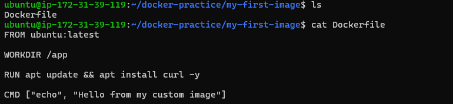

Step 2: Build the docker image using below command

```bash
docker build -t my-ubuntu:v1
```

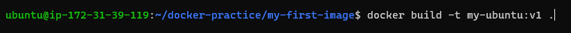

Step 3: Check whether the Docker image is created successfully using below command

```bash
docker images
```

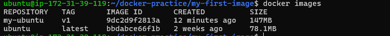

Step 4: Run the docker image by using below command

```bash
docker run $IMAGE_ID
```

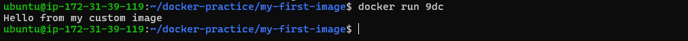

---

## TASK 2 : Dockerfile Instructions

---

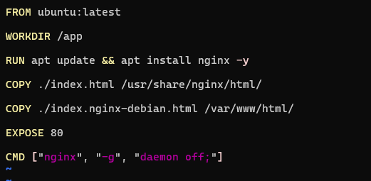

---

## TASK 3 : CMD vs ENTRYPOINT

---

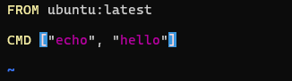


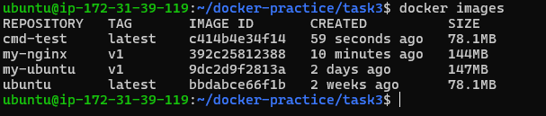

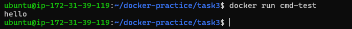

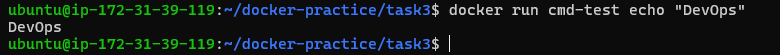

CMD - It is a default command, but still it can be overridden during runtime

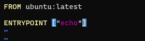

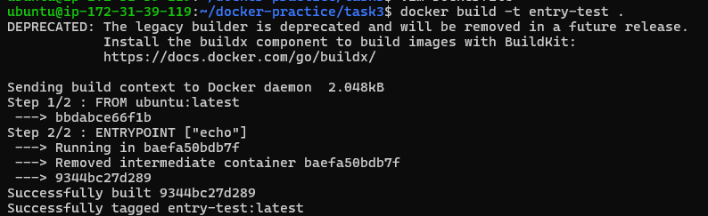

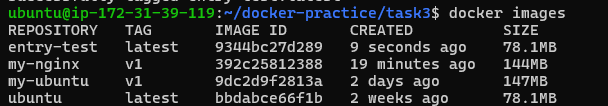

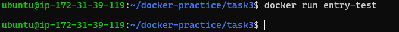

Entrypoint - In entrypoint the argument you pass after docker run imageid those argument will be appended to the entrypoint, this means whatever you add infront of docker run imageid those values will act as arguments for the command mentioned in the ENTRYPOINT

---

## TASK 4 : Build a simple Web App image

---

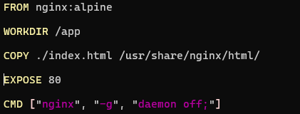

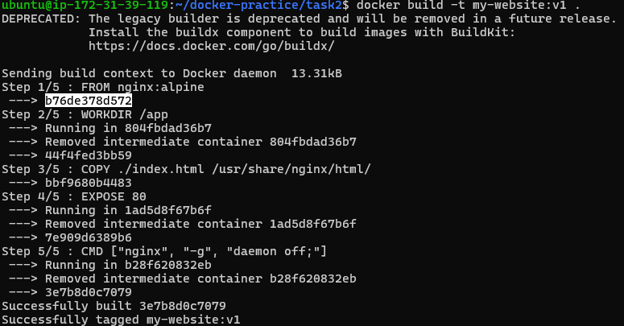

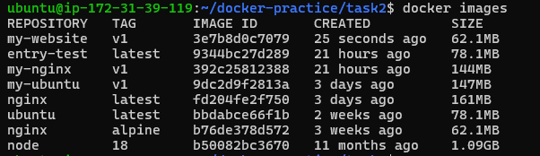

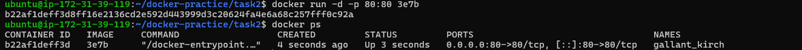

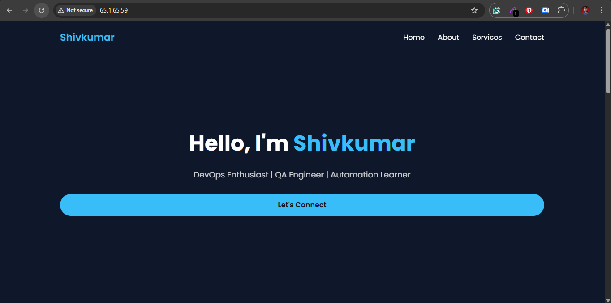

---

## TASK 5 : .dockerignore

---

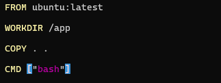

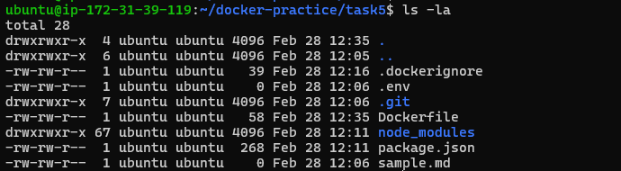

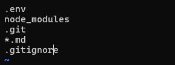

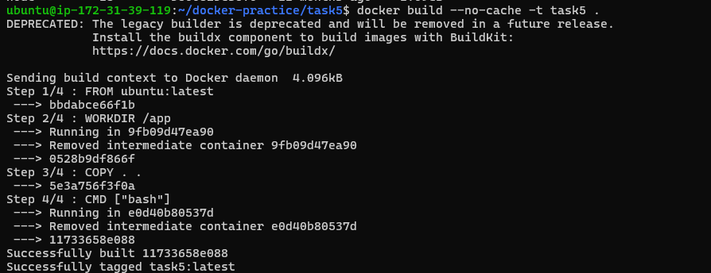

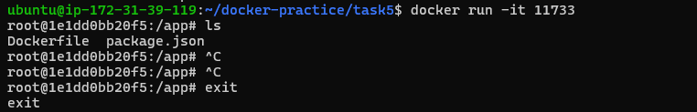

.dockerignore file ignore the files in the container which you mention in the file

---

## TASK 6 : Build Optimization

---

### 📌 Objective

- Understand how Docker layer caching works
- Observe how changing one instruction affects rebuild
- Learn why Dockerfile instruction order matters
- Optimize Dockerfile for faster builds

---

### 🧱 What I Learned About Docker Layer Caching

When Docker builds an image:

- It executes instructions **top to bottom**
- Each instruction creates a **layer**
- Docker stores layers in cache
- During rebuild, Docker checks if a layer changed

If nothing changed → ✅ Uses cache  
If something changed → ❌ Rebuilds from that layer onward

---

### 🔍 Practical Observations


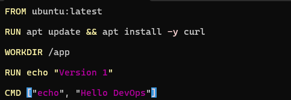

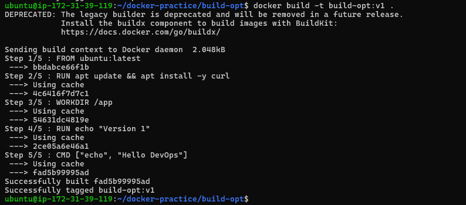

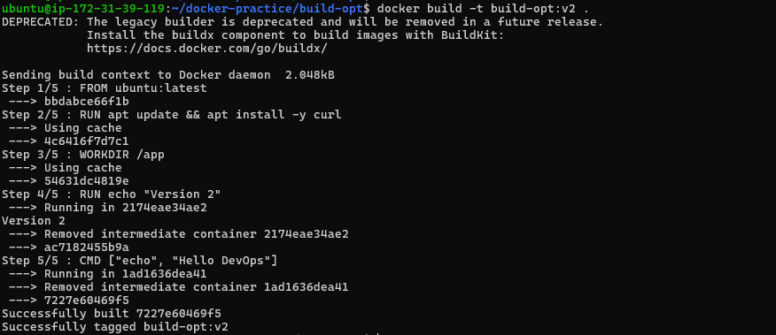

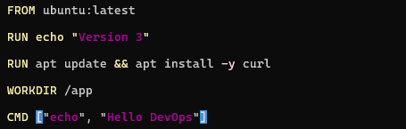

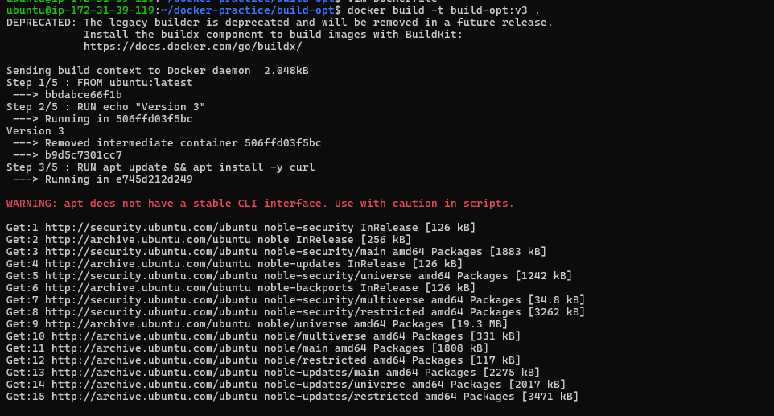

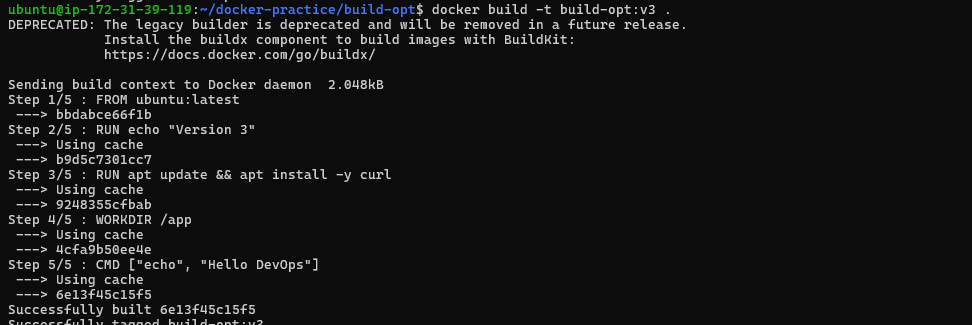