---
# Docker Volumes & Networking
---

---

## Task 1: The Problem

---

Step 1 : Create a MySQL container

```bash
docker run -d --name "mysql-container" -e MYSQL_ROOT_PASSWORD=Test@123 -p 3306:3306 mysql:8.0
```

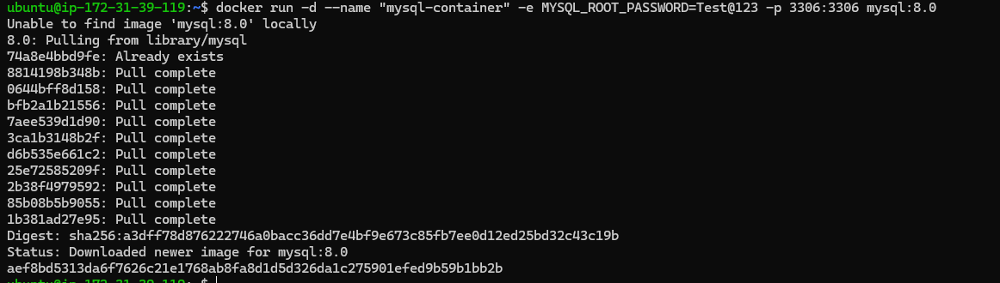

Step 2 : Create data inside MySQL

```bash
docker exec -it mysql-container mysql -u root -p
```

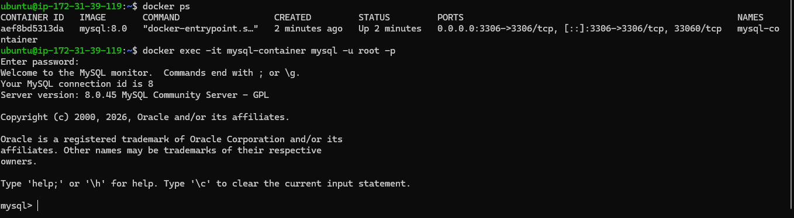

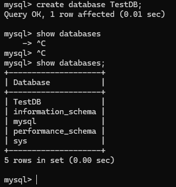

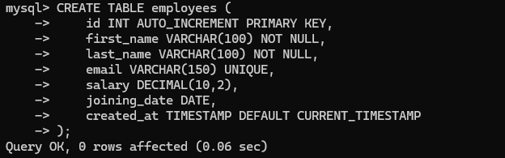

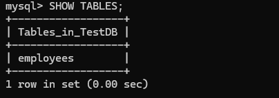


Step 3 : Stop and remove MySQL containers

```bash
docker stop $CONTAINER_ID && docker rm $CONTAINER_ID
```


Step 4 : Run a new MySQL container & check for data existence

```bash
docker run -d --name "mysql-container" -e MYSQL_ROOT_PASSWORD=Test@123 -p 3306:3306 mysql:8.0
```

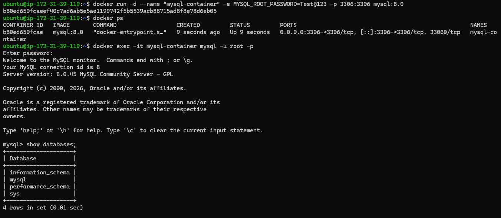

As given in the above screenshot we can see that the database created previously is not present in the new container, because the data in the container is limited to the specific container if you remove the container the data also gets deleted of that container.

---

## Task 2 : Named Volumes

---

Step 1 : Create a named volume

```bash
docker volume create mysql-data #to create a new volume
docker volume ls #to list the volumes
```

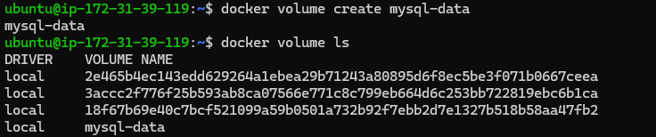

Step 2 : Run the MySQL container again but by attaching the volume to it

```bash
docker run -d --name "mysql-container" -e MYSQL_ROOT_PASSWORD=Test@123 -p 3306:3306 -v mysql-data:/var/lib/mysql mysql:8.0
```

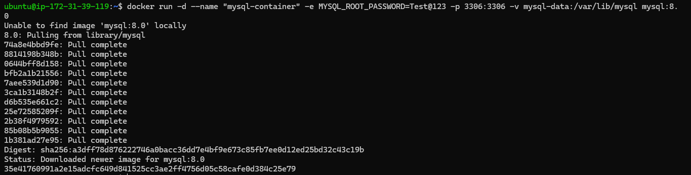

Step 3: Add some data stop and remove container

- Created Data

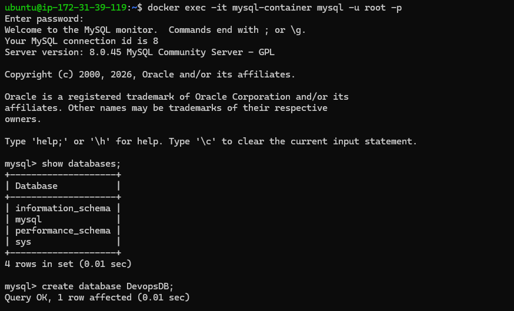

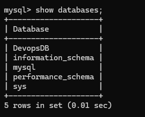

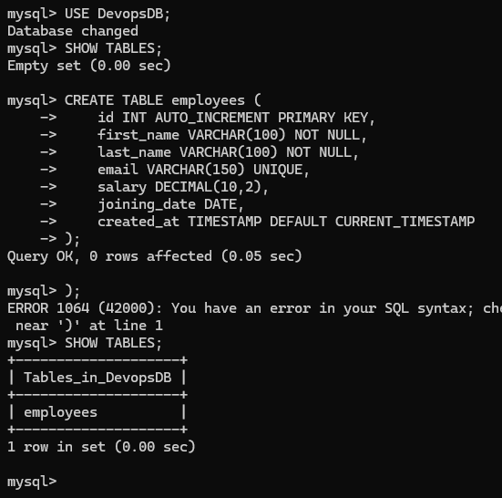

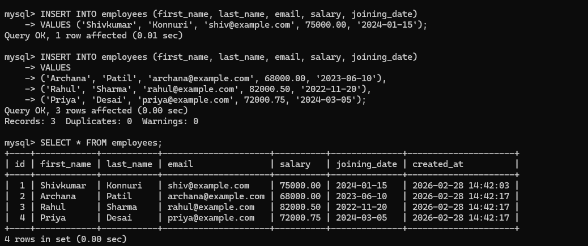

- Stopping and Removing containers

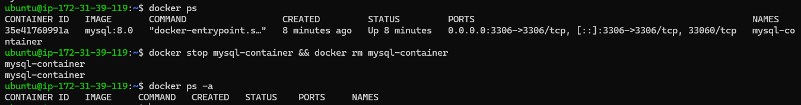

Step 4 : Run brand new container with same volume and check data persists or not

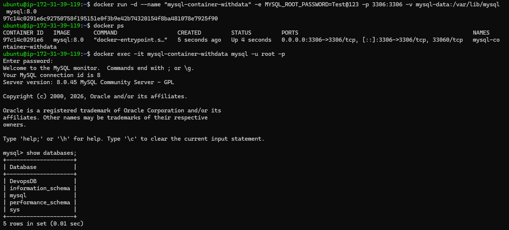

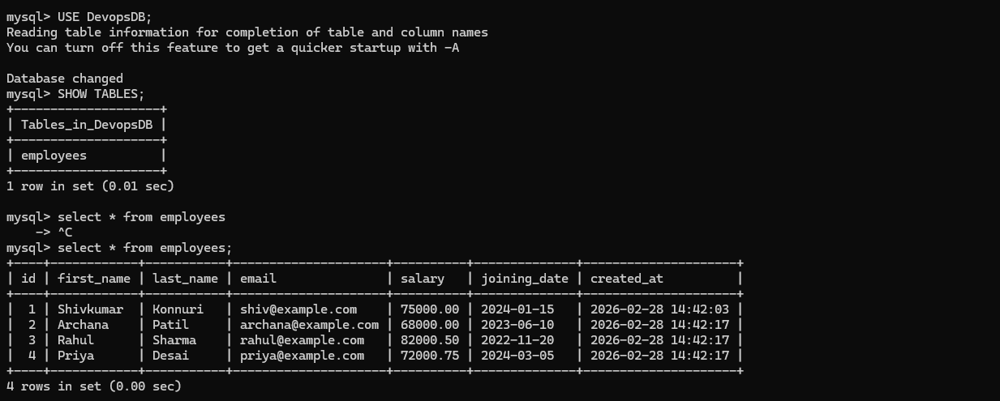

Now data persists due to volume mapped with the container and this is helpful when we accidentally remove the container or container crashes.

---

## Task 3 : Bind Mounts

---

**🧠 My Understanding**

By completing this task, I learned that:

- A bind mount allows a container to use files directly from the host system.
- I can modify files from my local directory without entering the container.
- Changes reflect immediately inside the container.
- No need to rebuild the Docker image.
- No need to restart the container.

This confirms that the container is reading files directly from the host.

---

**🔍 What Happened Technically**

When I ran:

```bash
docker run -d --name nginx-container -p 8080:80 -v $(pwd):/usr/share/nginx/html nginx:latest
```

The option:

```bash
-v $(pwd):/usr/share/nginx/html
```

Created a bind mount.

Meaning:

- My current host directory was mapped to `/usr/share/nginx/html` inside the container.
- Nginx served content directly from my host folder.
- Editing `index.html` locally immediately updated the webpage.

---

**🔄 Difference Between Named Volume and Bind Mount**

| Bind Mount | Named Volume |
|------------|--------------|
| Uses a specific host directory | Managed entirely by Docker |
| Direct file access from host | Stored inside Docker’s internal storage path |
| Best for development | Best for production & databases |
| Real-time file sync | Not intended for manual host editing |

**Practical Screenshots**

- Step 1 : Create a folder on your host machine with index.html file in it 

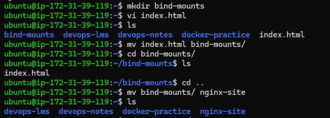

- Step 2 : Run an Nginx container and bind mount your folder to the Nginx web directory

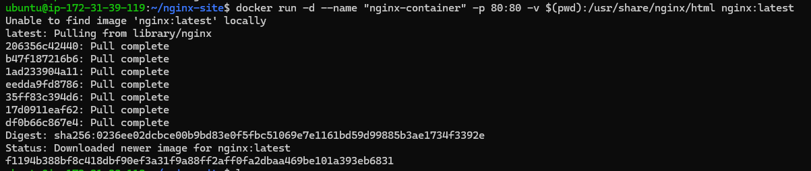

- Step 3 : Accessing my webpage in my browser

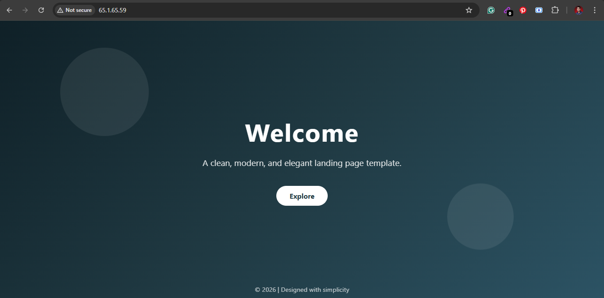

- Step 4 : Editing my webpage in my local directory


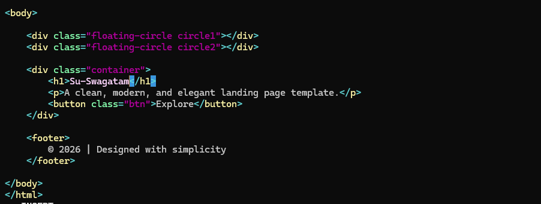

- Step 5 : Refresh the browser

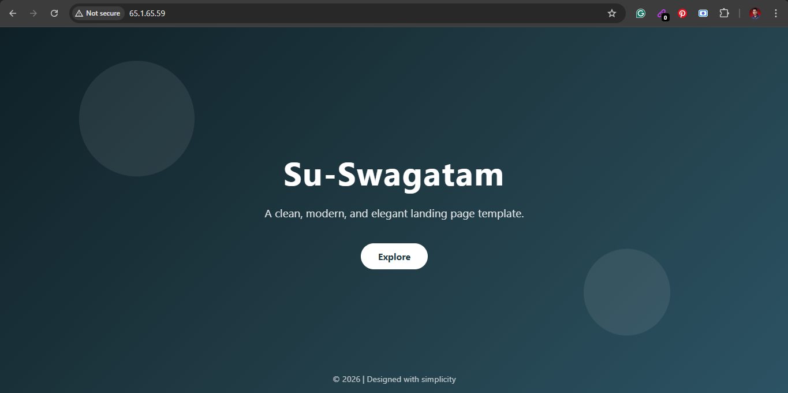

---

## Task 4 - Docker Networking Basics

---

- List all Docker Networks on your machine

Use below command to list all Docker Networks

```bash
docker network ls
```

- Inspect default bridge network

Use below command to inspect default bridge network

```bash
docker network inspect bridge
```
- Run two containers on default bridge ---- can they ping each other by name

```bash
docker run -d --name mysql-container --network bridge -e MYSQL_ROOT_PASSWORD=Test@123 -p 3306:3306 -v mysql-data:/var/lib/mysql mysql:8.0
docker run -d --name nginx-container -p 80:80 --network bridge -v $(pwd):/usr/share/nginx/html nginx:latest
docker exec -it nginx-container ping mysql-container
```

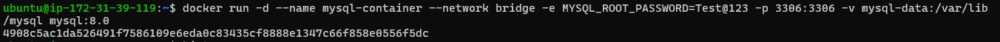

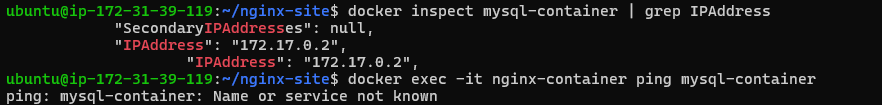

- Run two containers on default bridge ---- can they ping each other by their IPs

```bash
docker exec -it nginx-container ping 172.17.0.2
```

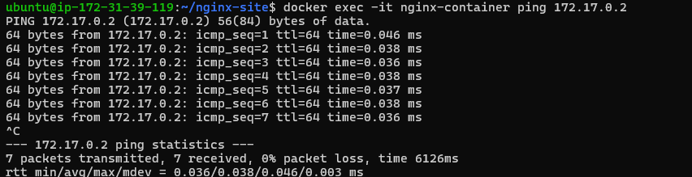

Using default bridge networks we can ping using only ip and not using name.

---

## Task 5 - Custom Networks

---

- Create a custom bridge network

```bash
docker network create my-app-net
docker network ls
```
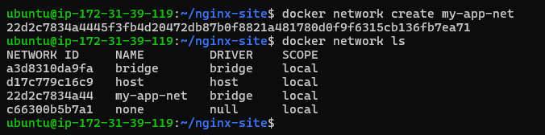

- Run two container on custom network

```bash
docker run -d --name mysql-container --network my-app-net -e MYSQL_ROOT_PASSWORD=Test@123 -p 3306:3306 -v mysql-data:/var/lib/mysql mysql:8.0
docker run -d --name nginx-container -p 80:80 --network my-app-net -v $(pwd):/usr/share/nginx/html nginx:latest
docker exec -it nginx-container ping mysql-container
```

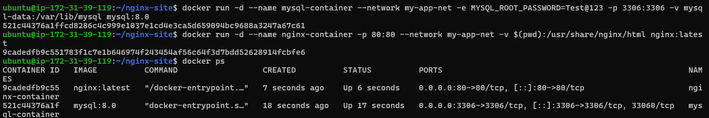

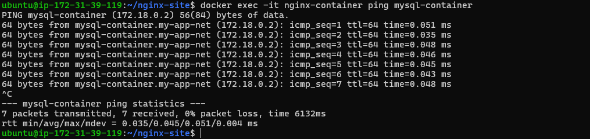

---
**Why containers cannot ping each other by name on the default bridge network,  
but can ping by name on a custom (user-defined) bridge network.**
---

🧠 My Understanding

When Docker is installed, it automatically creates a default network called:

bridge

If I run containers normally like this:

docker run -d --name mysql-container --network bridge -e MYSQL_ROOT_PASSWORD=Test@123 -p 3306:3306 -v mysql-data:/var/lib/mysql mysql:8.0
docker run -d --name nginx-container -p 80:80 --network bridge -v $(pwd):/usr/share/nginx/html nginx:latest

Both containers are attached to the default bridge network.

---

❌ Why Name-Based Ping Fails on Default Bridge

If I try:

docker exec -it nginx-container ping mysql-container  

It fails with:

Name or service not known

Reason:

- Default bridge does NOT have automatic DNS resolution.
- Container names are not registered in any internal DNS.
- Containers can only communicate using IP address.
- Docker does not automatically map container name → IP on default bridge.

So name resolution does not work.

---

🧠 Why Was It Designed Like This?

Default bridge is a legacy network.

Earlier versions of Docker used manual linking (--link).

It does not include Docker’s embedded DNS server.

So it only supports basic IP-based communication.

---

✅ Why Custom Bridge Works

When I create a custom network:

docker network create my-network  

Docker creates a user-defined bridge network.

This network includes:

- Built-in Docker DNS
- Automatic service discovery
- Container name → IP mapping

Now if I run:

docker run -d --name mysql-container --network my-app-net -e MYSQL_ROOT_PASSWORD=Test@123 -p 3306:3306 -v mysql-data:/var/lib/mysql mysql:8.0
docker run -d --name nginx-container -p 80:80 --network my-app-net -v $(pwd):/usr/share/nginx/html nginx:latest

And test:

docker exec -it nginx-container ping mysql-container  

It works.

Because Docker automatically resolves:

mysql-container → correct container IP

---

🔍 What Is Docker Embedded DNS?

In user-defined networks, Docker runs an internal DNS server.

It usually works on:

127.0.0.11

This DNS:

- Maintains container name mappings
- Updates automatically if container restarts
- Allows name-based communication
- Enables service discovery

Default bridge does NOT use this DNS system.

---

📊 Comparison

| Feature | Default Bridge | Custom Bridge |
|----------|----------------|---------------|
| Created automatically | Yes | No |
| Embedded DNS | No | Yes |
| Name-based ping | No | Yes |
| IP-based communication | Yes | Yes |
| Recommended for production | No | Yes |

---

## Task 6 - Put All Together

---


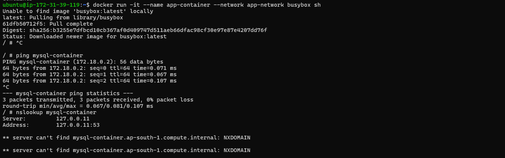

