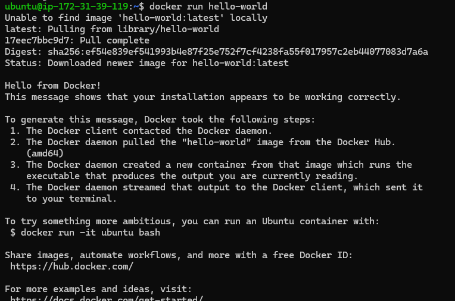
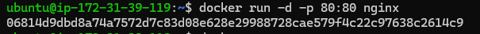
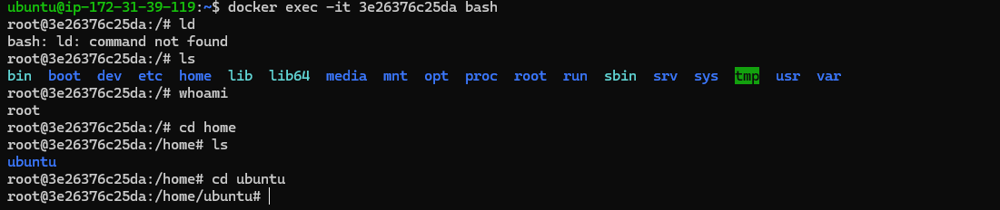
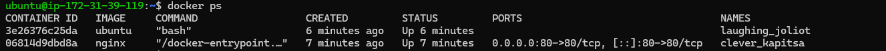
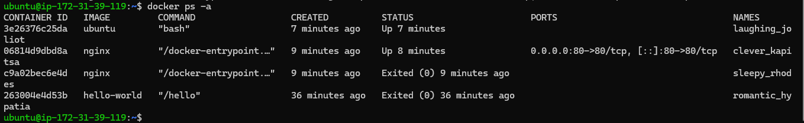
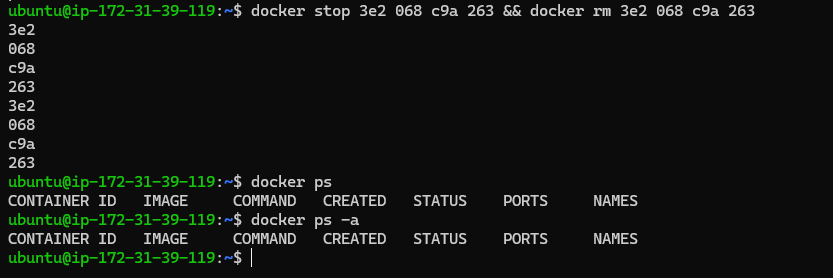
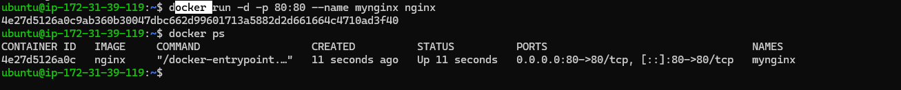
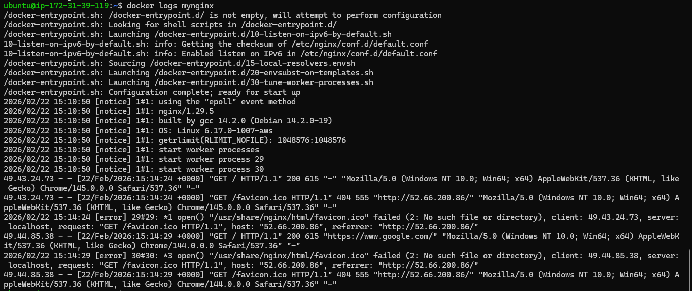
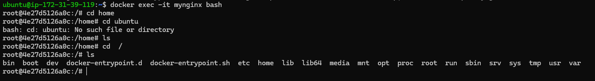

# 🐳 Introduction to Docker

---

## 📌 What is Docker?

Docker is a **containerization platform** that allows us to package an application along with its dependencies into a container.

The same container can be deployed across different environments (Development, Testing, Production) without making any changes.

It helps solve the common problem:

> "It works on my machine but not on the server."

---

## 📦 What is a Container?

A **container** is a lightweight and isolated runtime environment that contains:

- Application code  
- Required libraries  
- System dependencies  
- Configuration files  

All these components are packaged together as a single unit.

---

## ❓ Why Do We Need Containers?

Containers are used to:

- Automate application deployment  
- Avoid missing dependencies  
- Maintain consistency across environments  
- Improve portability  
- Reduce infrastructure-related issues  

---

## 🏗 Docker Architecture

Docker follows a **Client-Server Architecture**.

It consists of three main components:

1. Docker Client  
2. Docker Daemon  
3. Docker Registry  

---

## 1️⃣ Docker Client

The Docker Client is the interface where users execute Docker commands such as:

```bash
docker build
docker run
docker pull
```

When these commands are executed:

- The client sends the request  
- The request goes to the Docker Daemon  
- The daemon performs the required action  

---

## 2️⃣ Docker Daemon

The Docker Daemon (`dockerd`) is the main engine of Docker.

It is responsible for:

- Building Docker images  
- Running containers  
- Managing networks  
- Managing volumes  

The daemon listens for Docker API requests from the client and executes them.

---

## 3️⃣ Docker Registry

A Docker Registry is a storage location where Docker images are stored.

Example:

- Docker Hub (Public Registry)

From the registry, we can:

- Pull images  
- Push custom images  
- Share images across teams  

---

## 🧱 Docker Architecture Layers (Inside Docker Host)

Within the Docker Host, the following components exist:

| Component   | Description |
|------------|------------|
| Images     | Blueprint or template used to create containers |
| Containers | Running instance of an image |
| Networks   | Enable communication between containers |
| Volumes    | Provide persistent data storage |

---

## 🔄 How Docker Works (Flow)

1. The user runs a Docker command using the Docker Client.
2. The Docker Client sends the request to the Docker Daemon.
3. The Docker Daemon checks if the image exists locally.
4. If not available, it pulls the image from the Docker Registry.
5. The daemon creates and starts the container.
6. The application runs inside the container.

---

## 🎯 Summary

Docker allows us to package applications with all dependencies into containers and run them consistently across different environments using a Client-Server architecture.

---

## Task 2: Install Docker

1. I installed docker on my EC2 instance using command

```bash
sudo apt install docker.io
```
2. I verified installation using below commands

```bash
sudo systemctl status docker
sudo systemctl is-enabled docker
sudo systemctl is-active docker
```

3. I ran the **hello-world** container using below command

```bash
docker run hello-world
```

4. I read the output and below is my explaination

1. It checked whether the **hello-world** image is available locally
2. It did not find it on local so it pulled from the registry and downloaded the image
3. Created and excuted the container and exited the container
4. The hello world message was displayed on the screen



---

## Task 3: Run Real Containers

1. Run a nginx container

```bash
docker run -d -p 80:80 nginx
```


2. Run a Ubuntu container

```bash
docker run -d ubuntu
docker exec -it $CONTAINER_ID ubuntu bash
```



3. List all running containers

```bash
docker ps
```



4. List all container (including stopped ones)

```bash
docker ps -a
```



5. Stop and remove all containers

```bash
docker stop 3e2 068 c9a 263 && docker rm 3e2 068 c9a 263
```



---

## Task 4: Explore

1. I have already run a container in detach mode the difference is that the container will be running in background and also downloading and starting container logs will not be displayed and after starting only container id will be displayed

2. Give container a custom name

```bash
docker run -p 80:80 --name mynginx nginx
```



3. Map a port from the container to your host

```bash
docker run -p 80:80 --name mynginx nginx
```


4. Check logs of a running container

```bash
docker logs $CONTAINER_ID / $NAMES
```



5. Run a command inside a running container

```bash
docker exec -it $CONTAINER_ID bash
```


