# Docker Images and Container Lifecycle

---

## Task 1:  Docker Images

---

1. Pull the nginx, ubuntu, and alpine images from Docker Hub

```bash
docker pull nginx
docker pull ubuntu
docker pull alpine
```
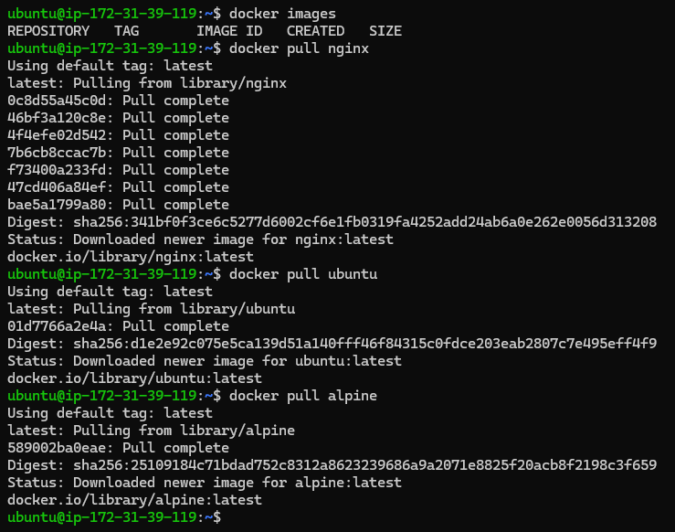

2. List all images on your machine — note the sizes

```bash
docker images
```

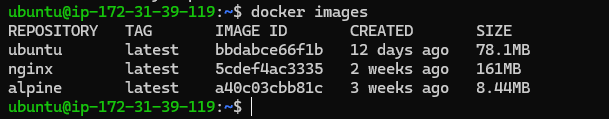

3. Compare ubuntu vs alpine — why is one much smaller?

📊 Ubuntu vs Alpine – Side-by-Side Comparison

| Feature            | Ubuntu Image       | Alpine Image                  |
|--------------------|-------------------|--------------------------------|
| 🔹 Size            | ~70–80 MB         | ~5–7 MB                        |
| 🔹 Base OS         | Debian-based      | Alpine Linux                   |
| 🔹 Package Manager | `apt`             | `apk`                          |
| 🔹 Shell           | Bash available    | Only `sh` (no bash by default) |
| 🔹 Security        | Good              | More secure (minimal packages) |
| 🔹 Debugging       | Easier            | Slightly harder                |
| 🔹 Library Support | Full support      | Some libraries missing         |
| 🔹 Build Speed     | Slower            | Faster                         |

Alpine is smaller as its light weight linux based image built on alpine linux
It is mainly used to create small secure and fast containers.

4. Inspect an image — what information can you see?

In this image i am able to see json format details in which i am able to see the env_path where the directory structure of linux is available and CMD as /bin/bash, means the shell will be used by default will be bash and also i am able to see disto and its version and many other details related to Docker.

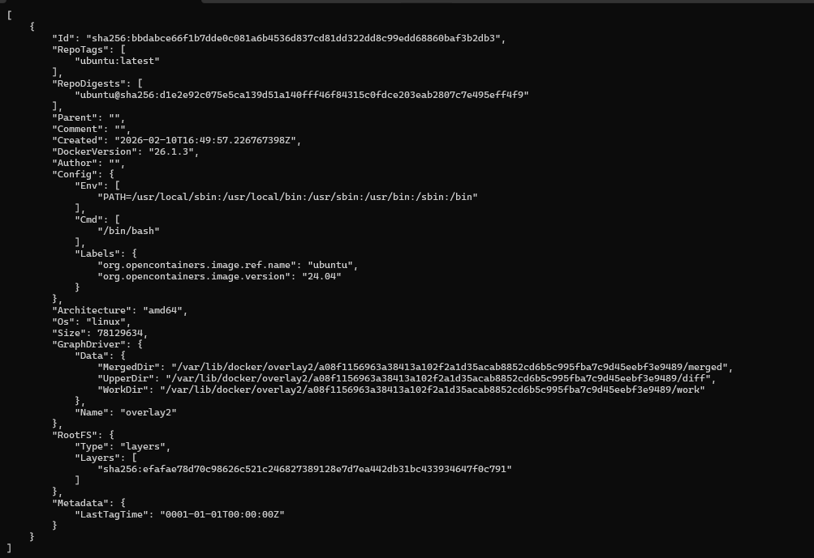

5. Remove an image you no longer need

To remove an image you no longer need you need to run below command

```bash
docker rmi $IMAGE_ID
```

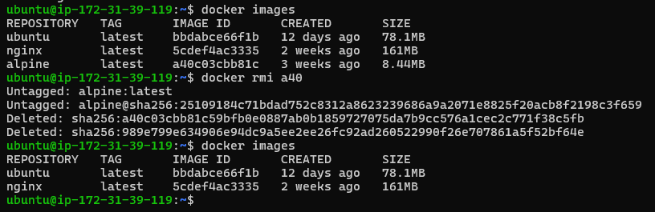

---

## Task 2: Image Layers

---

1. Run docker image history nginx — what do you see?

This shows the steps or layers used to create a container using image

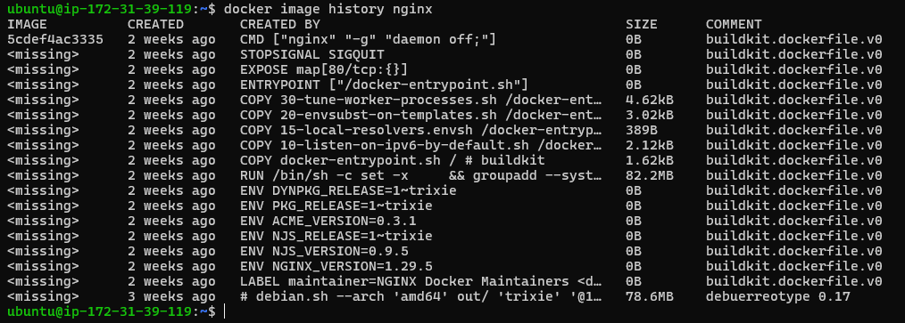

2. Each line is a layer. Note how some layers show sizes and some show 0B

Some layers show sizes because some layers show packages that will be copied so the size of those packages will be displayed, and the sizes with 0 include step / layer such as CMD, ENV, EXPOSE, WORKDIR, LABEL, etc which do not add to filesystem.


3. What are Layers and Why Does Docker Use Them?

📌 What are Layers?

Layers are the read-only changes created when we build a Docker image.

Each instruction in a Dockerfile creates one layer.

Example:

- FROM → Creates base layer  
- RUN → Creates new layer  
- COPY → Creates new layer  
- CMD → Creates metadata layer  

All these layers together form a Docker image.

After the image is created, we create a container from that image.

So the flow is:

Dockerfile → Image (Layers) → Container

---

Why Does Docker Use Layers?

Docker uses layers for:

1. Faster Build  
   If nothing changes in a layer, Docker reuses it instead of rebuilding it.

2. Efficient Storage  
   If multiple images use the same base image (like Ubuntu), Docker stores it only once.

3. Faster Download  
   When pulling an image, Docker downloads only the missing layers.

4. Easy Maintenance  
   Since each instruction creates a separate layer, it is easier to track changes.

🎯 Summary

Layers are filesystem changes created for each Dockerfile instruction.

Docker uses layers to make images reusable, faster to build, and storage efficient.

---

## Task 3: Container Lifecycle

---

1. Create Container - 

```bash
docker ps #No running container
docker ps -a #No containers
docker images #Lists all images
docker create -p 80:80 --name mynginx 5cd #Created container without starting it, but mapping 80 port of local to 80 port of container.
docker ps #Checked running containers
docker ps -a # Checked created containers
```

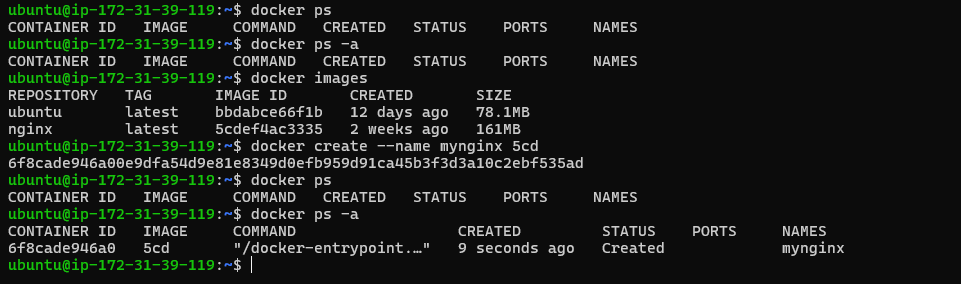

2. Start Container: 

```bash
docker ps
docker ps -a
docker start $CONTAINER_ID
docker ps
```

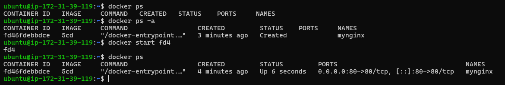

3. Pause the container and check status

```bash
docker ps
docker pause $CONTAINER_ID
docker ps
```

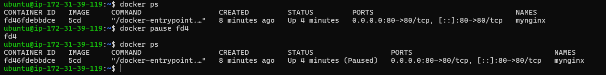

4. Unpause the container

```bash
docker ps
docker unpause $CONTAINER_ID
docker ps
```

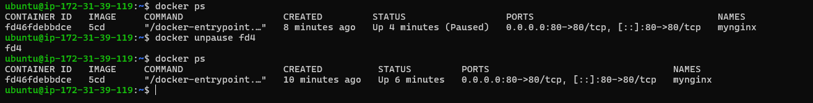

5. Stop it: 

```bash
docker stop $CONTAINER_ID
```

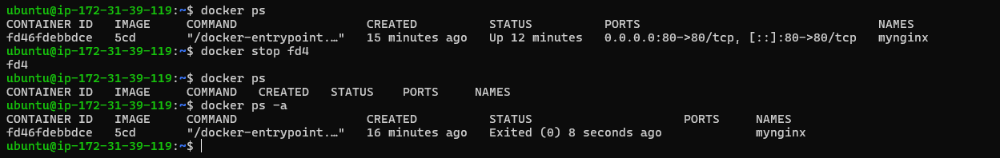

6. Restart it:

```bash
docker start $CONTAINER_ID
```

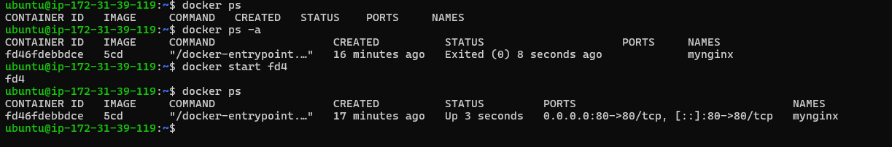

7. Kill it

```bash
docker kill $CONTAINER_ID
```

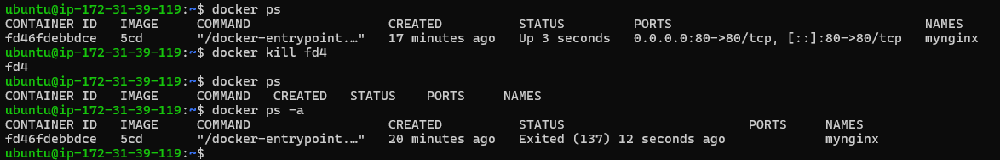

8. Remove it

```bash
docker rm $CONTAINER_ID
```

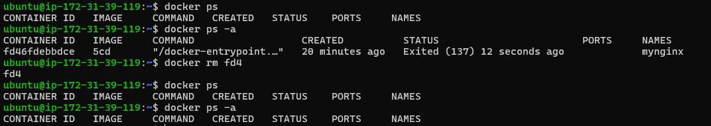

---

## Task 4: Working with running containers

---

1. Run an Nginx container in detached mode

```bash
docker run -d -p 80:80 --name mynginx nginx
```

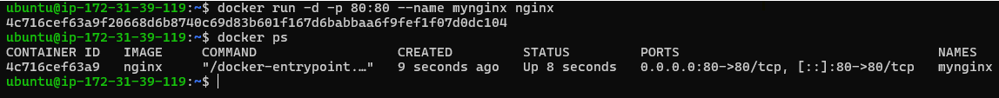

2. View its logs

```bash
docker logs $CONTAINER_ID #View logs without real-time
docker logs -f $CONTAINER_ID #View logs real-time
```

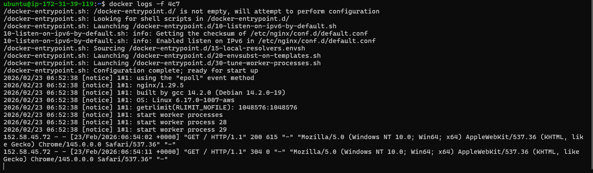

3. Exec into the container and look around the filesystem

```bash
docker exec -it $CONTAINER_ID bash
ls
```

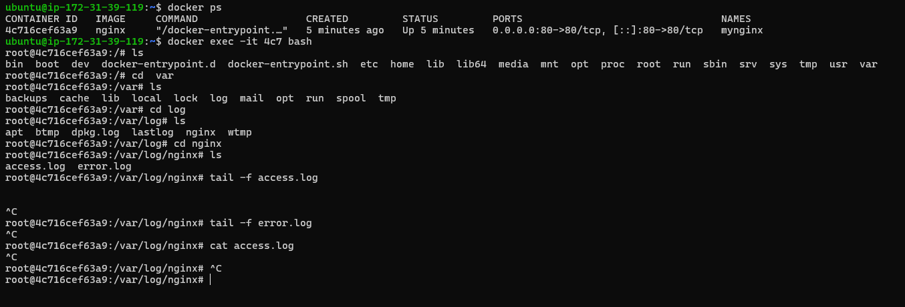

4. Run a single command inside the container without entering it

```bash
docker exec $CONTAINER_ID $SHELL_COMMAND
```

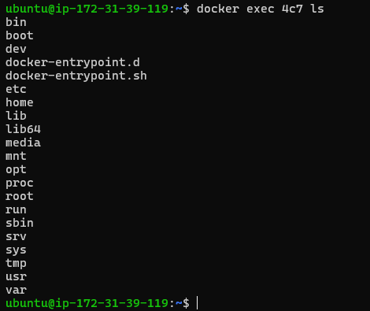

5. Inspect the container — find its IP address, port mappings, and mounts

```bash
docker inspect 4c7 | grep IPAddress
docker inspect 4c7 | grep Port
docker inspect 4c7 | grep Mounts
```

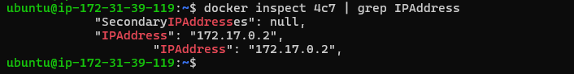

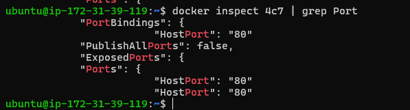

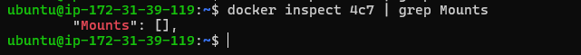

---

Task 5: Cleanup

```bash
docker stop $CONTAINER_ID1 $CONTAINER_ID2 . . . $CONTAINER_IDN
docker rm $CONTAINER_ID1 $CONTAINER_ID2 . . . $CONTAINER_IDN
docker system prune -a # This clear all stopped container, dangling and undangling images 
```
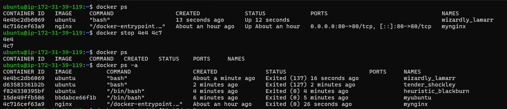

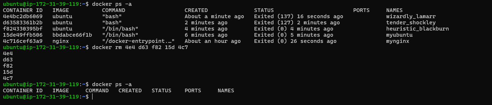

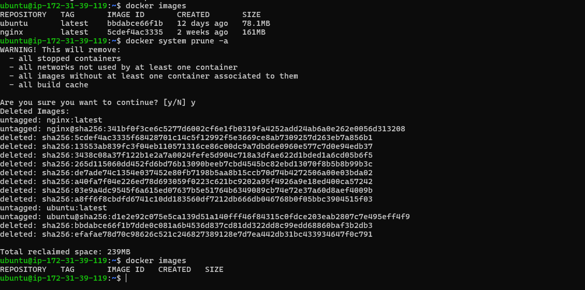

